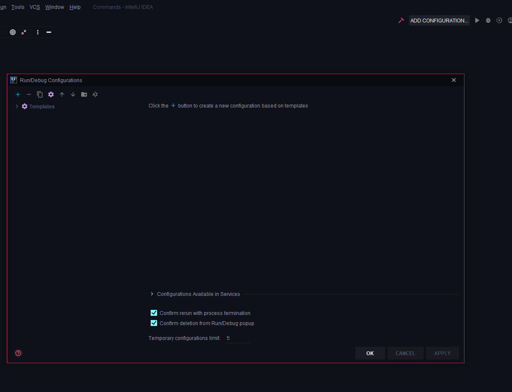
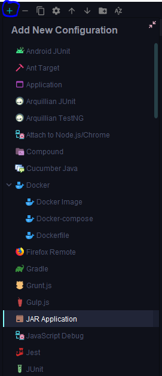
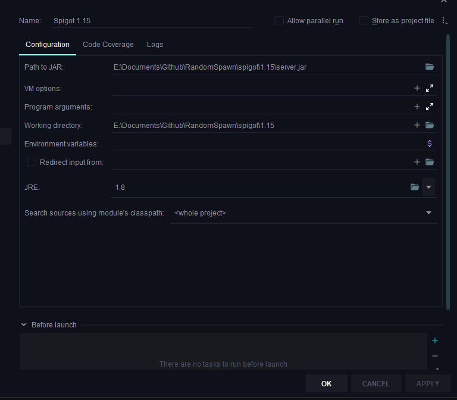

# How to run your minecraft server(s) in IntelliJ

## How to run your minecraft server(s) in IntelliJ

#### Process

The first step is to actually set up your server files, and for that, this tutorial will assume we're setting up a singular instance of Paper. To do that, I'd recommend simply using the terminal inside IntelliJ, and executing the following commands:

```bash
mkdir server && cd server
wget https://papermc.io/api/v1/paper/1.15.2/latest/download
echo eula=true >> eula.txt
```


Make sure to add the server directory to your gitignore.


This will download the latest 1.15.2 build of Paper, and populate the eula.txt. If you're unfamiliar with the terminal, it may be preferred to create the server manually, by hand, which is a process you've likely done a thousand times before. If not though, it's as simple as creating a folder called `server` (can be called anything), placing your server jar inside it, and if necessary, filling out the eula.

Time to actually tell IntelliJ how to run the server. In the top right corner of IntelliJ, there's be a highlighted button, called `ADD CONFIGURATION`, usually at least. If you've used Gradle on the project, any tasks you've ran will also appear there. That's irrelevant though, the point is there's a button there, and you need to click it. Upon doing so, either a window will open up, or a dropdown.




If you get the dropdown instead, simply click the `Edit Configurations...` button at the top.


Click the blue + in the top left corner of the popup, and select `JAR Application` from the dropdown.



Then proceed with filling out the following fields of the configuration: `Path to JAR:`, and `Working directory:` with their corresponding values. That is, path to jar, being the path of your server jar, and working directory, being the path of the directory your server jar is contained in (will be `server` if you followed this guide exactly). Here's mine:




* If using spigot itself (not a fork), you may also want to add `-DIReallyKnowWhatIAmDoingISwear` to the `VM options`. This will prevent the update checker from running, and potentially hindering your productivity as you have to wait 30 seconds for the server to start.
* You may want to put `nogui` in the `Program arguments`, to prevent the server GUI from opening.


Hit `APPLY`, and then `OK`. Select your newly made configuration in the top right drop down (if it wasn't automatically selected) and then press `Shift` + `F10`.
